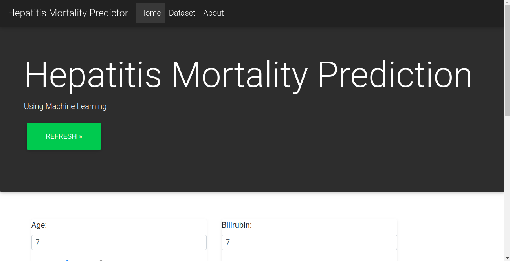
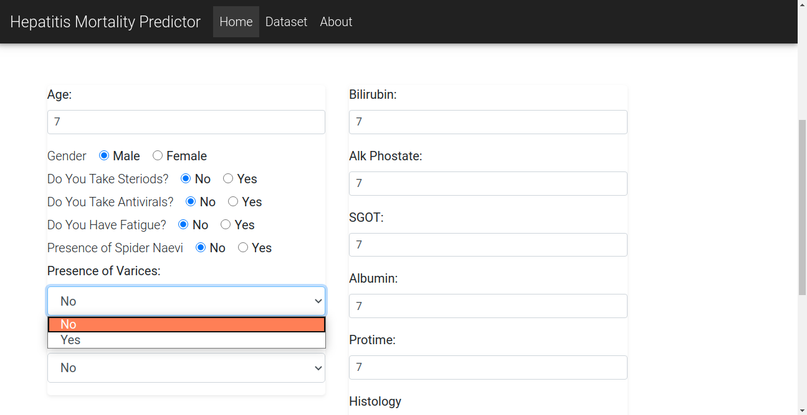
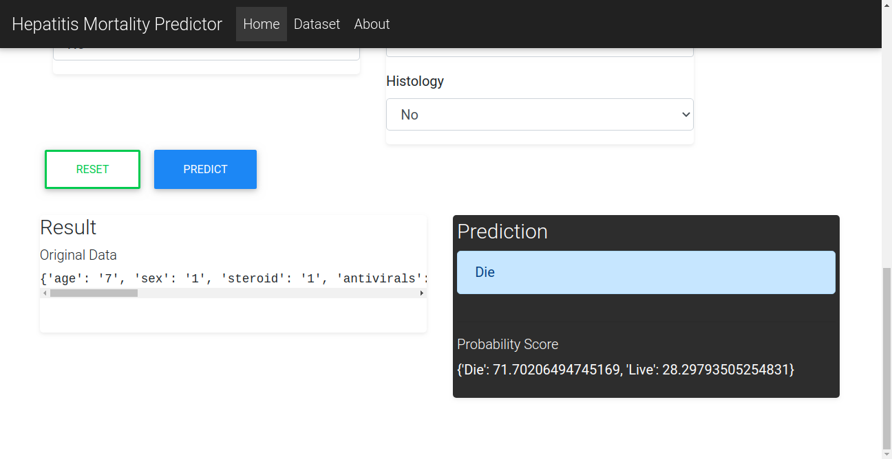

### Data Science Project
### Machine Learning Web App with Flask

#### Purpose
+ A productionized ML web app for hepatitis mortality prediction

#### Requirements
+ Flask
+ Pandas
+ Scikit-learn
+ Numpy
+ Bootstrap

#### Dataset source
Dataset UCI machine learning repository https://archive.ics.uci.edu/ml/datasets/hepatitis

#### Screenshot

